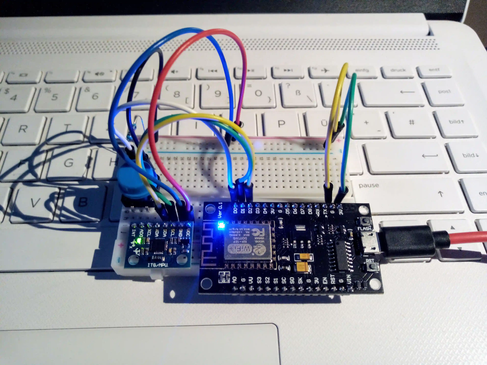
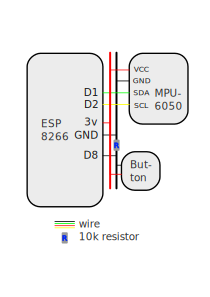
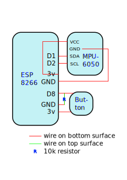

# ESP Zzzzleep 😴

In this project, we record motion data during sleep to analyze our sleep habits.

The setup on this page is designed to be active during sleep hours to collect sleep data. Analysis of this data provides valuable insight into your sleep activity.

For example: Long term data collection reveals sleep habits and can help you find out important facts about your personal sleep - such as the relationship between wake-up time and sleep quality, sleep quality of naps vs. sleep quality at night, etc.


## Bill of Materials / Things You'll Need
- ESP8266 (microcontroller)
- GY-521 MPU-6050 (accelerometer / gyroscope sensor)
- Button and 10k resistor
- Breadboard and wires
- Power supply (or powerbank for independant operation)
- USB / micro USB cable
- Soldering iron for preparation of the sensor module

- **Sostware:**
  - Arduino IDE: https://www.arduino.cc/en/software
  - Python3 dependencies: requests, matplotlib, numpy

## Complete Setup Instructions
We assume you are starting from scratch; only in posession of items mentioned in the BoM.

### 1. Preparation
If your sensor comes with seperate header pins I recommended you to solder them onto the chip first (the ESP8266 usually ships with pre-soldered header pins). If you are just getting started with soldering you can find guidance on this task here: https://www.instructables.com/Solder-Arduino-Header-Pins-Easily/

### 2. Assembly and Wiring
- Stick the sensor, button and ESP onto the breadboard similar to how it is shown in the first image
- Attach the wires according to the scheme shown in the second image (the resistor is a 10k resistor)

#### Breadboard Setup:


#### Wiring Scheme:


#### Soldering Scheme:


### 3. Preparing your ESP8266
Setup Arduino IDE with ESP8266 on your computer. You need to do this in order to compile and upload the code onto the ESP. Follow advice from these sites if you don't know how to do this:
- https://www.arduino.cc/en/Guide
- https://www.instructables.com/Setting-Up-the-Arduino-IDE-to-Program-ESP8266

Clone the repository and open esp.ino in the Arduino IDE. Change your SSID and password in the seperade arduino_secrets.h file. Maybe you want to adjust the configuration in the source code as well. When you are read hit upload.

### 4. Fetch the data
The ESP will start gathering data as soon as it is connected to a power source. When you want to fetch the data from your compyter follow these steps:
- Make sure your WiFi hotspot is running so the ESP can connect to it
- Press the button; the builtin LED will start blinking and turn on permanently when the connection is established
- You can run the retrieve_data.py script from your machine and it will save the sensor data from the ESP to a file
- Press the button again at any time to close the connection


### 5. Analyze!
Using the analyze_data.pyt script we can perform automated analysis of our sleep-data. The results will be displayed in a graph.

From the sensor data we can get an approximate view on our sleepcycles.


Sample motion data:


## Retrieve and Analyze Scripts
```script.py <filename>```

Example usage:

```retrieve_data.py mySleepToday```

```analyse_data.py mySleepToday```
### Dependencies
retrieve_data.py
- python-requests

analyze_data.py
- python-matplotlib
- python-numpyt

