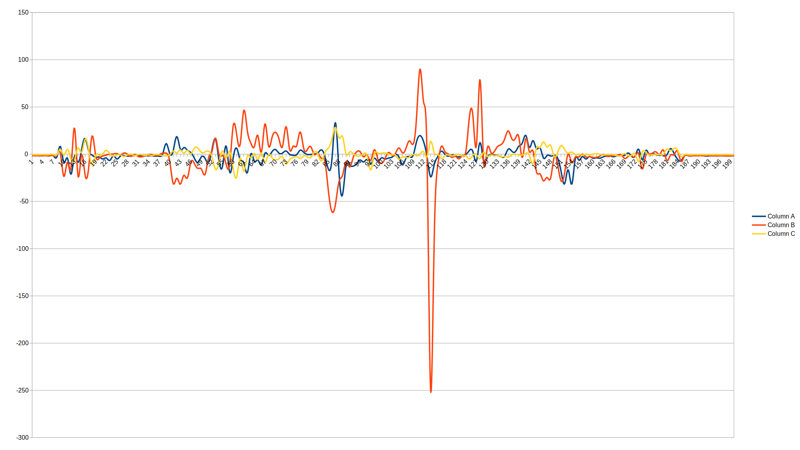

# ESP8266-server-GY-521-MPU-6050
### Fetch server data from a Linux machine:
```console
while true; do
curl esp.ip.here >> out.csv
done
```
### Visualize:


XYZ Gyroscope


Temperature
#### ... and measure your sleep activity
