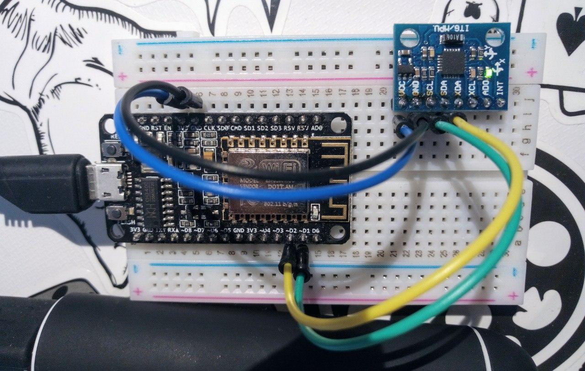
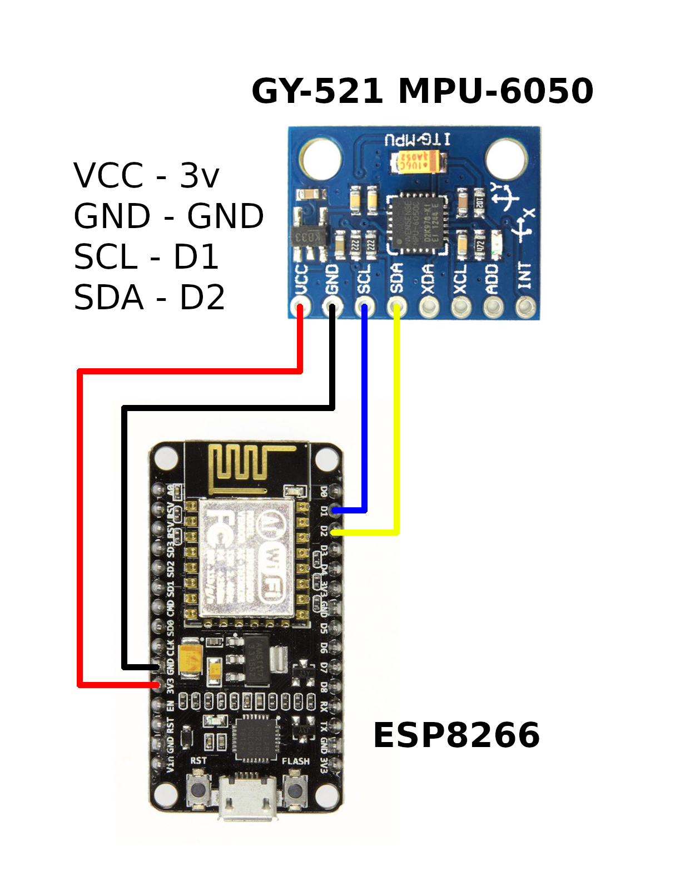
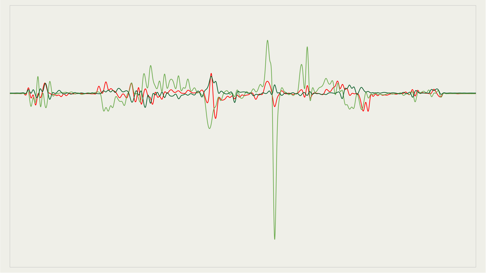
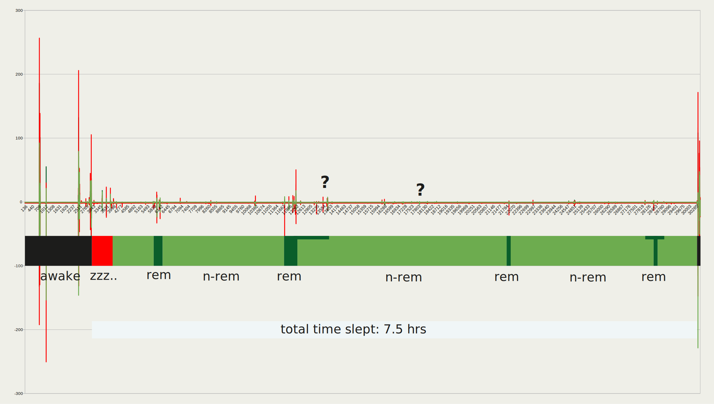

# ESP Zzzzleep 😴

## Bill of Materials
- ESP8266 (microcontroller)
- GY-521 MPU-6050 (accelerometer / gyroscope sensor)
- breadboard and wires
- power supply or powerbank for independant operation
- soldering iron for preparation of the sensor module

## Complete Instructions
We assume you are starting from scratch; only in posession of items mentioned in the BoM.

#### 1. Preparation
If your sensor comes with seperate header pins it is recommended to solder them onto the chip first (the ESP usually ships with presoldered header pins). If you are just getting started with soldering you can find guidance on this task here: https://www.instructables.com/Solder-Arduino-Header-Pins-Easily/

#### 2. Assembly and Wiring
- Stick the sensor and the ESP onto the breadboard similar to how it is shown in the first image
- Attach the wires according to the scheme presented in the second image

##### Breadboard Setup:


##### Wiring Scheme:


#### 3. Preparing your ESP
Setup Arduino IDE with ESP8266 on your computer. You need to do this in order to compile and upload the code onto the ESP. Follow advice from these sites if you don't know how to do this:
- https://www.arduino.cc/en/Guide
- https://www.instructables.com/Setting-Up-the-Arduino-IDE-to-Program-ESP8266

When your Arduino IDE is ready to upload to ESP8266 copy and paste the code from esp.ino into Arduino IDE and hit upload. Make sure you choose the appropriate board and USB port.

[todo]

### Fetch data from linux machine
```bash
while true
do
    curl esp.ip.here >> out.csv
done
```
More info in [esp-init.bash](#init-script), this is some example CSV output
```console
-1.6870, -1.6183, -0.4351, 29.0947, 2059
-1.7175, -1.4122, -0.5496, 29.0476, 2059
-1.8625, -1.7099, -0.5725, 29.1417, 2060
-1.4580, -1.6106, -0.5496, 29.0947, 2060
```




### Movement indicates sleep cycles


### Init script
Meant to be run before going to bed with ESP :)  
It will  
 - connect to the ESP AP (via networkmanager, nmcli)
 - test connection to the IP provided
 - start background loop (curl fetches data)
 - quit when q is entered, everything else is ignored
 - => Don't quit with CTRL-C, the loop will keep running and you have to kill it manually. Entering q does this for you.
 
Consider making the following changes
 - SSID of ESP access point
 - password of ESP access point
 - private IP address of ESP
 - SSID of home wifi (reconnect before quitting)
 - (filename)
   
This script is meant to serve as guidance for you to create your own.
