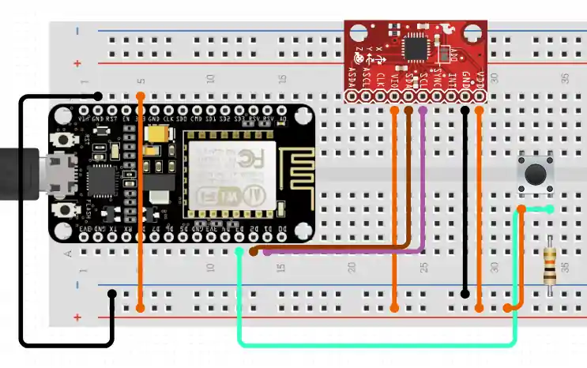

# ESP Zzzzleep 😴

In this project, we record motion data during sleep to analyze our sleep habits.

The setup on this page is designed to be active during sleep hours to collect sleep data. Analysis of this data provides valuable insight into your sleep activity.

For example: Long term data collection reveals sleep habits and can help you find out important facts about your personal sleep - such as the relationship between wake-up time and sleep quality, sleep quality of naps vs. sleep quality at night, etc.

## Bill of Materials / Things You'll Need
- ESP8266 (microcontroller)
- GY-521 MPU-6050 (accelerometer / gyroscope sensor)
- Breadboard and wires
- Power supply or powerbank for independant operation
- USB / micro USB cable
- Soldering iron for preparation of the sensor module

- **Sostware:**
  - Arduino IDE: https://www.arduino.cc/en/software
  - IOT2TANGLE Streams HTTP Gateway: https://github.com/iot2tangle/Streams-http-gateway

## Complete Setup Instructions
We assume you are starting from scratch; only in posession of items mentioned in the BoM.

### 1. Preparation
If your sensor comes with seperate header pins I recommended you to solder them onto the chip first (the ESP8266 usually ships with pre-soldered header pins). If you are just getting started with soldering you can find guidance on this task here: https://www.instructables.com/Solder-Arduino-Header-Pins-Easily/

### 2. Assembly and Wiring
- Stick the sensor and the ESP onto the breadboard similar to how it is shown in the first image
- Attach the wires according to the scheme shown in the second image

#### Breadboard Setup:

#### Wiring Scheme:

### 3. Preparing your ESP8266
Setup Arduino IDE with ESP8266 on your computer. You need to do this in order to compile and upload the code onto the ESP. Follow advice from these sites if you don't know how to do this:
- https://www.arduino.cc/en/Guide
- https://www.instructables.com/Setting-Up-the-Arduino-IDE-to-Program-ESP8266

Clone the repository and open the files in Arduino IDE. Change your SSID and password in the seperade arduino_secrets.h file. Maybe you want to adjust the configuration in the source code as well. When you are read hit upload.

### 4. Fetch the data
The ESP will start gathering data and send it back via WiFi/HTTP (and serial connection) when you press the button. In order to work with the data you must have a server receive it. This will be provided in near future.

### 5. Analyze!
Information about your sleep cycles can provide valuable insights. You can find out for example different parameters which influence your sleep quality or learn about your long-term sleep habits.

## Movement / Gyro data indicates sleep cycles
Data during sleep:

Sample motion data:

